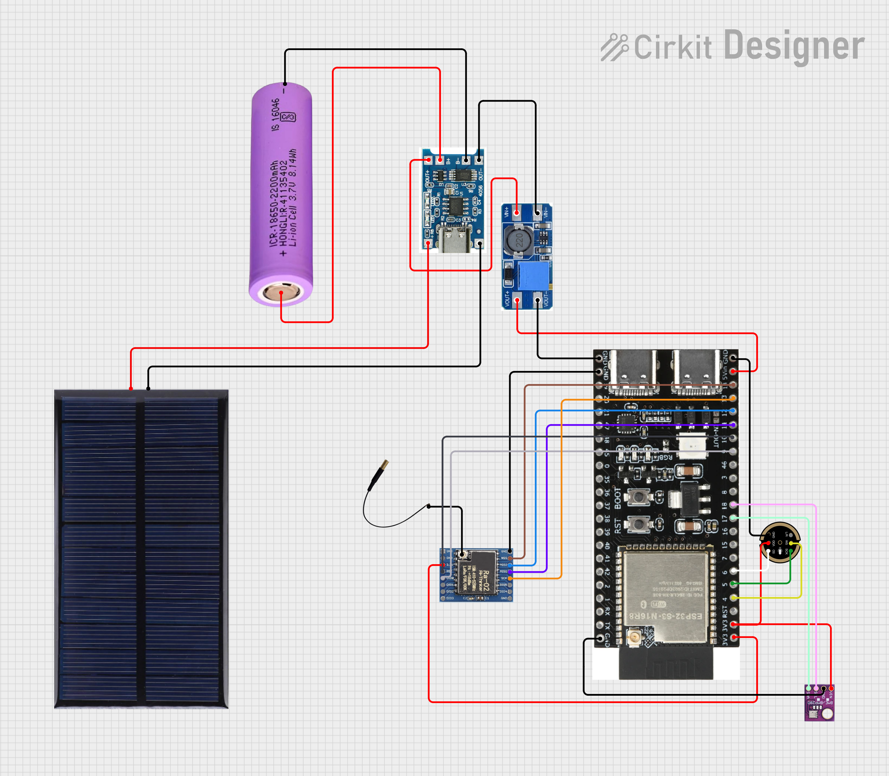

# Forest Sentinel

Forest Sentinel is a LoRa-based environmental monitoring setup with:
- an **ESP32-S3 sender node** (`sender.ino`) that runs on-device audio inference,
- an **ESP32 receiver/base station** (`reciver.ino`) that enriches packets with radio metadata,
- a **web dashboard** (`index.html`) that visualizes node status, map positions, and live charts.

## What this project does

- Captures audio from an INMP441 microphone
- Runs Edge Impulse inference on the sender node
- Sends compact JSON telemetry over LoRa (433 MHz)
- Receives and forwards telemetry to serial for the dashboard
- Shows live node cards, map markers, and signal/environment charts

## Project organization

| Category | Files | Purpose |
|---|---|---|
| Firmware - Sender Node | `sender.ino` | Audio capture, inference, alert logic, LoRa transmission |
| Firmware - Receiver Node | `reciver.ino` | LoRa packet receive, duplicate detection, serial JSON output |
| Dashboard | `index.html` | Browser UI with serial connection, map, charts, node state panel |
| Training Data | `training data/` | WAV samples (chainsaw, gunshot, noise) used for model work |
| Model Package | `impulse.zip` | Edge Impulse exported library/package |
| Hardware References | `photos/circuit_image.png`, `photos/Sender Node.jpeg`, `photos/Reciver Node.jpeg` | Circuit and node wiring visuals |

## Circuit diagram



## Data flow

1. Sender node reads mic + BMP280, runs inference, builds JSON packet.
2. Sender transmits packet via LoRa.
3. Receiver node reads packet, appends RSSI/SNR/duplicate flags, prints JSON over serial.
4. Dashboard reads serial lines and updates map/cards/charts in real time.

## JSON packet format

Typical payload fields used across sender/receiver/dashboard:

```json
{"id":1,"s":0,"c":"noise","p":0.10,"t":28.5,"db":42.3,"pr":1013.2,"rssi":-72,"snr":8.5,"dup":0}
```

## Quick start

1. Flash `sender.ino` to ESP32-S3 sensor node.
2. Flash `reciver.ino` to ESP32 receiver/base station.
3. Open `index.html` in Chrome/Edge (Web Serial supported).
4. Click **CONNECT SERIAL** and select the receiver COM port.

## Required Arduino libraries

- arduino-LoRa (Sandeep Mistry)
- Adafruit BMP280 Library
- Adafruit Unified Sensor
- Edge Impulse Arduino SDK (from `impulse.zip`)

---
